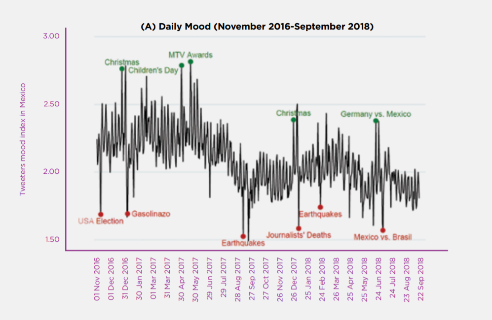

## A brief on Big Data and its relation to wellbeing

---
| Field | Value |
|----|----|
| Writer | Shruti Katyal - MCA II yr|
| Editor | Kajal Gupta |
| Status |  |
| Plagiarism| None [Report](./plag-reports/plag-big-data.pdf) |

---	 	 	

Let’s talk about big data in the context of digital media. Although we have been in the big data era for some time now, there has been a certain hike in digital media usage over the past decade. People, especially teenagers spend a big portion of their time on the internet primarily; for social media and texting.

 According to a World Happiness Report released by the United Nations, adolescents in 2017 spent an average of 5-6 hours a day online and spent less time on activities that do not involve a screen. If we compare this finding to any data from a few decades ago, we can establish that this has created a 180-degree shift in the fundamentals of socializing and yet it is still not conducive to the increase of the measure of happiness in an individual.

According to another finding in the same report, the measure of happiness of the American people has improved somewhat since 2010, yet it still cannot catch up with that of the people who were born between 1980 and 1992. People who are more willing to spend leisure time in family gatherings or prefer to do exercise, or any other sort of outdoor activities, tend to grasp a better sense of emotional satisfaction.

However, despite the rapid development of IT being the biggest factor of change, it is possible for the existence of reverse causation between happiness and digital media. That is, it is reasonable to believe that people's happiness is decreasing with the increasing use of digital media or it could also be the case that unhappy people turn to digital media to find some sort of comfort. Several organizations like governments, hospitals, and supermarkets take advantage of this concept of reverse causation. Organizations gather big data about their customers and then use it to strategize their revenue opportunities better. 

Most of this data is gathered in exchange for rewards, loyalty programs, premium access, gift cards, surveys, etc. Consumers naively give access to such information by signing privacy agreements without giving it a once-over. Another source of gathering such data is through considered consent. That is, companies gather data that are open to the public eye, usually in the form of visual information, basic demographic or behavioral characteristics. 

By analyzing such data, they can analyze and monitor people's consumption habits correlating to individual happiness, such as the health pattern of hospital customers or the pattern of product consumption amongst alcoholics. Many organizations can also analyze people's mental health from big data. For example, they can ascertain & collect people's daily emotions from an individual’s social media presence/activities.

A good example of one study is a mood analysis based on the Twitter activities of users in Mexico between November 2018 and September 2018. Look at the graph below and notice how the positive and negative ratio of words varied from day to day in 2016-2018. However, you can also see that there are some extreme values on days like
 

    1. Christmas 2017
    2. Or Mexico vs Germany Game in 2018
    3. Or Election of Donald Trump in 2016

Organizations use such data to extract advantageous information that can be used to serve specific purposes. This might be good for companies, but it does have some negative implications for people. The worst-case scenario to this is that some of the databases are also used by people operating the ‘Dark Web’ part of the world wide web. Every identity or every user on the internet is susceptible to analysis like this. Even in incognito mode, a user cannot hide most of the browsing session. Only a very small percentage of highly skilled internet users know how to hide their presence on the internet.

In a build-up, people tend to become addicted to the virtual world for various reasons such as socioeconomic inequality, social contagion, mental health disorders, etc., but in another reality, it is scary to think that your every move on the internet is being monitored by someone and for reasons, you might never find out. To conclude, let’s just hope that we the people can keep up with the rapidly changing digital world so that it doesn’t make our worst dreams come true.

