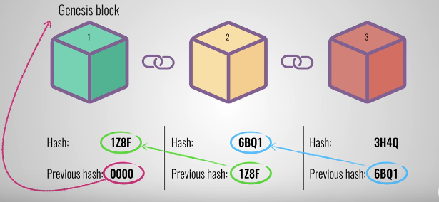
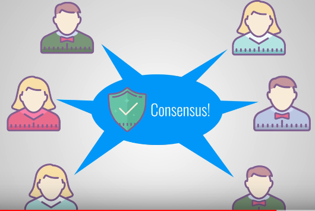

# Blockchain - Beyond the buzzword

---

| Question   | Answer                                                            |
| ---------- | ----------------------------------------------------------------- |
| Writer     | Aryan Sindwani - MCA I year                                       |
| Editor     | Kajal Gupta                                                       |
| Status     | Edited                                                            |
| Plagiarism | None [Report](./plag-reports/plag-blockchain.pdf)                 |

---

You may have heard of "blockchain," the record-keeping system behind bitcoin. And while trying to learn about it, you must have read definitions like: “blockchain is a decentralized, distributed, public ledger”. These are some difficult words. The good news is, understanding blockchain is a whole lot easier than what this definition makes it look like. 

## What is blockchain?
As one can guess from the name itself, a blockchain is simply a chain of blocks, precisely said, ledgers, containing information. The idea was originally thought of in 1991 to secure digital documents by time-stamping them to protect them from getting backdated or tampered with. It went mostly unused through the decades until 2009 when Satoshi Nakamoto (presumed pseudonymous) used the idea to create a digital currency – “Bitcoin”.

## How does blockchain work?

A blockchain can be thought of as a distributed ledger with each block containing :
    1. Data
    2. Hash of its own
    3. Hash of the previous block

The data stored in a single block is subject to the type of the blockchain. In the case of a cryptocurrency blockchain, the block stores the transactional data such as the bank details of the beneficiary, the amount of credit etc. For facilitating encryption, each block consists of a hash which acts like the fingerprint of any block as it is unique for each block in the blockchain. Once created, the hash of the block is calculated. If the contents of the block changes, it changes the hash of the block also.

## Why is a blockchain so secure?

Every block stores the hash of the preceding block, thus making it secure.

Let’s understand this with the picture above. Suppose the second block here is tampered causing its hash to change. This action will make block 3 invalid as it contains invalid hash of the preceding block. To maintain consistency the hash of the third block would need to be updated. And so on. Therefore, to change a single block, every single block after it would require an update as well.

A hash is easy to calculate with a ton of powerful machines available in the market and hence can be cracked. To save the blockchain from such systems, proof-of-work(POW) technique is used. It’s a technique that decelerates the creation of each block so that the tampering becomes more difficult. In the proof of work system, computers that want to add a block to a network must “prove” that they have earned the right to do so. They prove their eligibility by solving a compound computational maths problem. Thus, the security of a blockchain drives from its innovative use of hashing and POW.

A blockchain also provides security by being distributed on a decentralized network or in other words, a peer-to-peer network instead of a central database. Every peer on the network is provided with a duplicate of the blockchain. When a new block is produced, every blockchain copy on the network is updated. All the nodes establish a consensus to acknowledge which block is valid and which is not. This ensures that the tampered blocks are rejected from the network.

Consider a network of 100,000 nodes. To tamper with a block on the blockchain, one needs to calculate the hashes of all the blocks and their POW which takes a huge amount of time. This has to be done for more than 50% of the nodes on the P2P network. This is almost impossible to accomplish, making blockchain the safest way to transact.

## Potential uses of blockchain

    1. Banking: It is often a slow and complex system due to multiple intermediaries. With the banks removed from the process and validation on going 24 hours, using blockchain, a transaction can be settled within seconds.

    2. Real Estate: Often recording property rights on paper are confusing and prone to human errors.  Using blockchain, all of this work can be made verifiable and transparent. Property owners and officials must agree to their title deeds recorded on the blockchain.

    3. Online Voting: Recording votes using blockchain can eliminate fraud as it is nearly impossible to tamper with a block. This makes the entire process transparent and reduces human effort by giving instant results.

    4. Stock Trading: Currently it takes about 2-3 days for the settlement of stocks and bonds making it a slow and inefficient process. Blockchain can be used in buying and selling of stocks as it validates and processes transactions quickly. Intercontinental Exchange, the parent company of NYSE has launched its own bitcoin futures contracts.

Blockchain is an emerging technology and brings with itself seeming enormous and unmeasurable possibilities. The value of a bitcoin from 0.08 USD/coin in 2010 to 8000 USD/coin in 2019 showcases its lightning rise and hence is the technology to look out for the next few decades.

